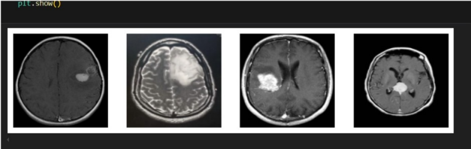
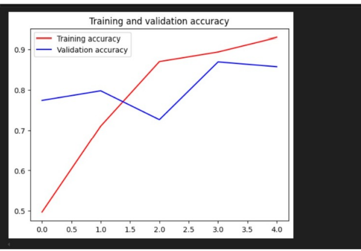
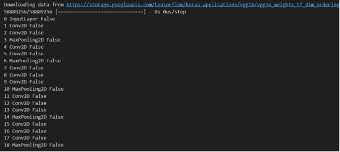

# Cortex Tumor Detector Using Artificial Intelligence with Deep Learning Techniques  

We are developing a system to detect and classify brain tumors from MRI scans using AI-driven deep learning methods.

---

## About  
This project aims to create an innovative system for the automated detection and classification of brain tumors using advanced AI and deep learning techniques. By leveraging state-of-the-art image processing libraries (OpenCV, TensorFlow, PyTorch) and pretrained deep learning models, the system analyzes MRI scan images to identify the presence of brain tumors with high accuracy.  

The system is capable of detecting subtle anomalies in brain structure, assisting in the early diagnosis of brain tumors. Its applications span medical diagnostics, research, and telemedicine, providing an accessible, automated, and reliable solution for brain tumor detection using standard MRI images.  

---

## Features  
The **Cortex Tumor Detector** is a powerful system for automated brain tumor diagnosis and classification. By integrating frameworks like TensorFlow, Keras, and OpenCV, it processes MRI scans and identifies abnormalities using advanced deep learning architectures such as CNNs (Convolutional Neural Networks).  

### Key Features  
- **Real-time Tumor Detection:** Detects and highlights abnormal regions in MRI scans.  
- **Classification:** Distinguishes between different tumor types (e.g., gliomas, meningiomas).  
- **Accuracy and Precision:** Achieves high diagnostic accuracy using pretrained models like ResNet, VGG, and custom architectures.  
- **Accessibility:** Works with standard MRI scan images, eliminating the need for costly imaging tools.  
- **Customizability:** Allows fine-tuning for specific datasets and medical requirements.  
- **Data Logging:** Provides options for storing results and tracking patient progress over time.  
- **User-Friendly Interface:** Ensures ease of use for medical professionals and researchers alike.  

### Applications  
1. **Medical Diagnostics:** Assisting radiologists in tumor detection.  
2. **Telemedicine:** Enabling remote diagnosis and second opinions.  
3. **Research:** Supporting studies on brain tumor characteristics.  
4. **Training:** Providing annotated data for educational purposes.  

---

## Output  
The system provides output in the form of annotated MRI images highlighting detected tumor regions, accompanied by a confidence score and classification results.  

### Example Outputs  

---

## Results and Impact  
This project delivers significant results and impacts in the field of healthcare and medical diagnostics:  
- **Improved Diagnostic Accuracy:** Reduces false negatives and false positives in tumor detection.  
- **Early Detection:** Enhances chances of successful treatment through timely diagnosis.  
- **Accessibility:** Makes advanced diagnostic tools available to underserved areas with minimal resources.  
- **Efficiency:** Reduces the workload of radiologists by automating the initial screening process.  
- **Cost-Effective Solution:** Eliminates the need for expensive imaging hardware.  

In clinical settings, the system aids in diagnosing brain tumors faster and more accurately, potentially saving lives. In telemedicine, it supports healthcare providers in remote areas by offering reliable diagnostic tools. Additionally, in research, the system accelerates the analysis of brain tumors, driving advancements in treatment and understanding of neurological conditions.  

Overall, this project contributes to healthcare innovation, empowering medical professionals with AI-driven tools to combat brain tumors effectively.  

---

## References  
1. Gupta, P., Gupta, S., & Rajput, H. (2022) "AI-Based Brain Tumor Detection and Classification Using Deep Learning."  
2. Litjens, G., Kooi, T., Bejnordi, B. E., et al. (2017) "A Survey on Deep Learning in Medical Image Analysis."  
3. Szegedy, C., Liu, W., Jia, Y., et al. (2015) "Going Deeper with Convolutions: Convolutional Neural Networks."  
4. Ronneberger, O., Fischer, P., & Brox, T. (2015) "U-Net: Convolutional Networks for Biomedical Image Segmentation."  
5. Sun, W., Shi, L., & Wang, X. (2023) "Deep Learning-Based Brain Tumor Detection for MRI Applications."  
6. TensorFlow Documentation (2023) "Deep Learning Models for Image Classification."  
